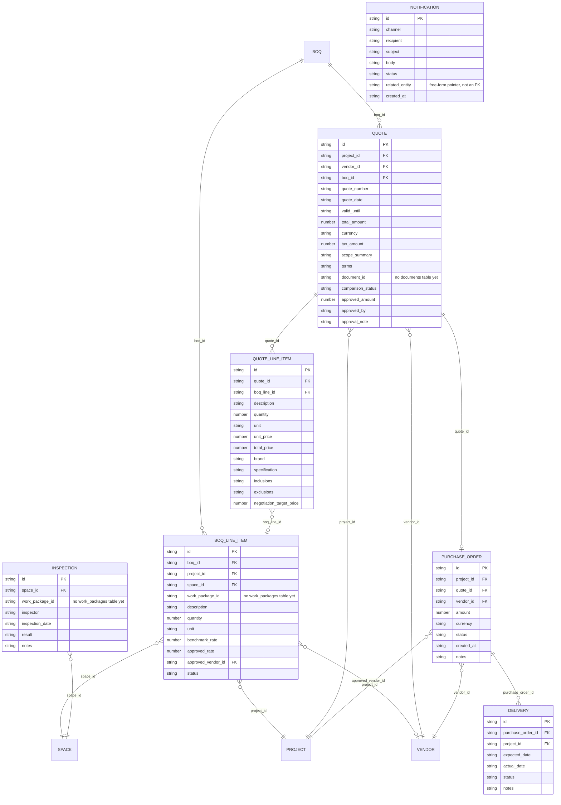

# Data Model

Entity-relationship reference for the residence project, derived from the two
sources of truth:

- **`types/index.ts`** — the locked TypeScript contract (constitution §4). The seed
  modules in `data/*.ts`, the repository layer, and the API's read responses all
  conform to these shapes.
- **`api/migrations/001_init.sql`** — the Supabase Postgres schema. It mirrors the
  contract (snake_case columns) and adds backend-only tables for the procurement
  pipeline and quality tracking.

> Conventions that shape this model (constitution §2):
>
> - **Relations are by ID, never by display name.** Cross-references are
>   `*Id: string` / `*Ids: string[]` fields resolved at render time via
>   `lib/relations`. In Postgres these are plain `VARCHAR` / `VARCHAR[]` columns —
>   there are **no foreign-key constraints**; integrity is enforced by
>   `npm run verify` (seed) and the API layer.
> - **Optional single references use `""`**, not `null` (e.g. `Drawing.spaceId`
>   when a drawing isn't room-specific).
> - **Many-to-many links are denormalized on both sides** (e.g. `Space.domainIds`
>   and `Domain.spaceIds`) rather than via join tables.

## Core contract (types/index.ts — 14 entities)

```mermaid
erDiagram
    PROJECT {
        string id PK
        string publicTitle "anonymized public identity"
        string publicSubtitle
        string city
        string designer
        string heroImage
        string conceptStatement
        string internalName "portal-only"
        string villaNo "portal-only"
        string address "portal-only"
        string plotArea
        string builtUpArea
        number floors
        string status
        string startDate
    }

    SPACE {
        string id PK
        string slug UK
        string name
        string description
        string designIntent
        string image
        stringArray domainIds FK
        stringArray materialIds FK
        stringArray furniture "free text, not linked"
        stringArray lighting "free text, not linked"
        stringArray vendorIds FK
        stringArray drawingIds FK
        stringArray decisionIds FK
        stringArray lessonIds FK
        string status "Concept|Design|Execution|Completed"
    }

    DOMAIN {
        string id PK
        string slug UK
        string name
        string description
        stringArray spaceIds FK
        stringArray drawingIds FK
        stringArray vendorIds FK
        stringArray lessonIds FK
        string status "Not Started|In Progress|Approved|Completed"
    }

    DRAWING {
        string id PK
        string title
        string domainId FK
        string spaceId FK "empty if not room-specific"
        string revision
        string date
        string status "Draft|For Review|Approved|Superseded|IFC"
        string consultant
        string fileUrl
        string notes
    }

    VENDOR {
        string id PK
        string name
        string category
        string contactPerson
        string phone
        string email
        string location
        string website
        string quoteUrl
        boolean finalized
        number rating "0-5"
        string notes
    }

    MATERIAL {
        string id PK
        string name
        string category
        stringArray spaceIds FK
        string vendorId FK
        string status
        string image
        string notes
    }

    PROCUREMENT_ITEM {
        string id PK
        string item
        string category
        string spaceId FK
        string brand
        string vendorId FK
        string country
        number quantity
        number estimatedPrice
        number quotedPrice
        number negotiatedPrice
        number finalPrice
        string currency "INR|EUR|USD"
        string status "Identified...Closed (8 stages)"
        string deliveryDate
        string installationDate
        string warranty
        string notes
    }

    DECISION {
        string id PK
        string title
        string domainId FK
        string spaceId FK
        string type "Design|Material|Vendor|Cost|Technical|Schedule|Quality"
        stringArray optionsConsidered
        string finalDecision
        string reason
        string costImpact
        string timeImpact
        string qualityImpact
        string date
        string owner
        string status "Open|Decided|Revisit|Closed"
    }

    SNAG {
        string id PK
        string spaceId FK
        string category
        string description
        string photoUrl
        string assignedTo
        string priority "Low|Medium|High|Critical"
        string status "Open|In Progress|Fixed|Verified|Closed"
        string targetClosureDate
        string actualClosureDate
        string notes
    }

    BOQ {
        string id PK
        string vendorId FK
        string category
        string quoteDate
        number originalAmount
        number negotiatedAmount
        number gst
        number total
        string paymentStatus "Unpaid|Advance Paid|Part Paid|Fully Paid"
        string fileUrl
        string notes
    }

    LESSON {
        string id PK
        string title
        string category
        string summary
        string domainId FK
        string spaceId FK
        json impact "cost, time, quality, design"
    }

    PROGRESS_ENTRY {
        string id PK
        string date
        string phase
        string spaceId FK
        string workCompleted
        stringArray photos
        string issues
        string nextAction
        string owner
        string status
    }

    WARRANTY {
        string id PK
        string item
        string category
        string vendorId FK
        string brand
        string purchaseDate
        string warrantyStart
        string warrantyEnd
        string invoiceUrl
        string manualUrl
        string serviceContact
        string notes
    }

    GALLERY_ITEM {
        string id PK
        string title
        string category "render|drawing|progress|final|material|furniture|lighting|landscape"
        string image
        string spaceId FK "empty if not space-specific"
        string domainId FK "empty if not domain-specific"
        string caption
    }

    SPACE }o--o{ DOMAIN : "domainIds / spaceIds"
    SPACE }o--o{ MATERIAL : "materialIds / spaceIds"
    SPACE }o--o{ VENDOR : "vendorIds"
    SPACE ||--o{ DRAWING : "drawingIds / spaceId"
    SPACE ||--o{ DECISION : "decisionIds / spaceId"
    SPACE ||--o{ LESSON : "lessonIds / spaceId"
    SPACE ||--o{ PROCUREMENT_ITEM : "spaceId"
    SPACE ||--o{ SNAG : "spaceId"
    SPACE ||--o{ PROGRESS_ENTRY : "spaceId"
    SPACE ||--o{ GALLERY_ITEM : "spaceId (optional)"
    DOMAIN ||--o{ DRAWING : "drawingIds / domainId"
    DOMAIN }o--o{ VENDOR : "vendorIds"
    DOMAIN ||--o{ DECISION : "domainId"
    DOMAIN ||--o{ LESSON : "lessonIds / domainId"
    DOMAIN ||--o{ GALLERY_ITEM : "domainId (optional)"
    VENDOR ||--o{ MATERIAL : "vendorId"
    VENDOR ||--o{ PROCUREMENT_ITEM : "vendorId"
    VENDOR ||--o{ BOQ : "vendorId"
    VENDOR ||--o{ WARRANTY : "vendorId"
```

`PROJECT` is a single standalone record (no ID links to or from it in the
contract); its portal-only fields (`villaNo`, `address`, …) are never rendered on
the public site (constitution §5).

## Backend-only extensions (api/migrations/001_init.sql)

The API adds a procurement pipeline (BOQ line items → quotes → purchase orders →
deliveries), quality inspections, and a notification log. These exist only in
Postgres / the FastAPI domain layer — they are **not** part of `types/index.ts`.

Known dangling references in the SQL schema: `work_package_id` (on
`boq_line_items` and `inspections`) and `document_id` (on `quotes`) have no
corresponding tables yet.

## Presentation-only structures (not entities)

Two modules carry image-set content keyed by **domain slug** rather than by ID,
and are rendered directly by `RenderingGallery`:

- `data/renderings.ts` — `renderingsByDomain: Record<slug, RenderingSet[]>`
  (auto-generated by `scripts/gen-renderings.ts`).
- `data/drawingSheets.ts` — `drawingSheetsByDomain: Record<slug, RenderingSet[]>`
  (A2 drawing PDFs converted to JPGs).

`RenderingSet` = `{ title, width, height, images?, subsections? }`. These are
view models, not relational entities — they have no IDs and nothing links to
them, so they sit outside the diagram above.
